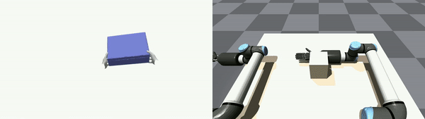
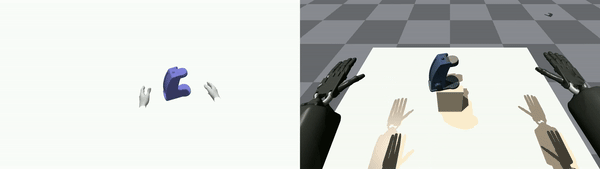
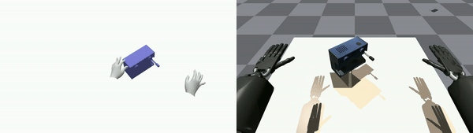
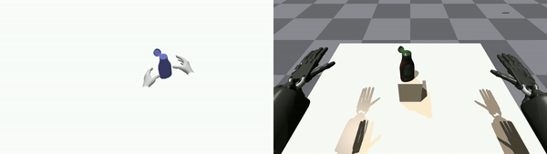
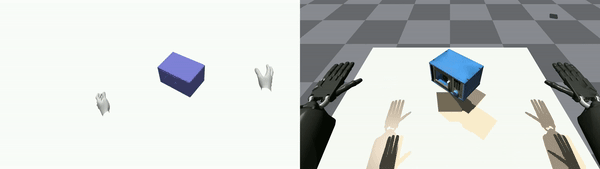
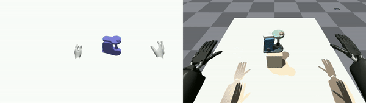
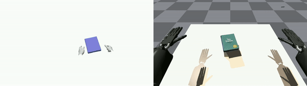
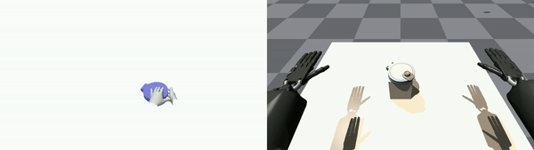
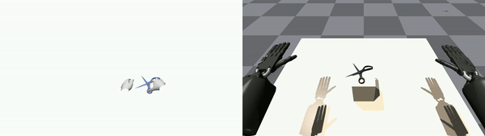

# Object-Centric Dexterous Manipulation from Human Motion Data

<div align=center></div>

## Table of Content
- [Overview](#overview)
- [Installation](#installation)
- [Quick demo](#quick-demo)
- [Training](#training)
- [Evaluation](#evaluation)
- [Acknowledgement](#acknowledgement)
- [Citations](#citations)
- [License](#license)

## Overview

This repository is the implementation code of the paper "Object-Centric Dexterous Manipulation from Human Motion Data"([Paper](https://arxiv.org/abs/2309.00987), [Website](https://cypypccpy.github.io/obj-dex.github.io/)) by Yuanpei Chen, Chen Wang, Yaodong Yang and C. Karen Liu. In this repo, we provide our full implementation code of quick demo, training, evaluation, and real-world system.

## Installation
* python 3.8
```	
conda create -n objdex python=3.8
conda activate objdex
```

* IsaacGym (tested with `Preview Release 3/4` and `Preview Release 4/4`). Follow the [instruction](https://developer.nvidia.com/isaac-gym) to download the package.
```	
tar -xvf IsaacGym_Preview_4_Package.tar.gz
cd isaacgym/python
pip install -e .
cd examples
(test installation) python examples/joint_monkey.py
```
* ObjDex
```	
git clone https://github.com/cypypccpy/ObjDexEnvs.git
cd ObjDex
pip install -r requirements.txt
pip install -e .
```

* ARCTIC datasets

Follow the [ARCTIC github repo](https://developer.nvidia.com/isaac-gym) to download the datasets and process them. Then modified the 
`arctic_raw_data_path` to your `raw_seqs` folder (for example: `~/arctic/data/arctic_data/data/raw_seqs`) and `arctic_processed_path` to your `processed` folder in the `ObjDexEnvs/dexteroushandenvs/cfg/dexterous_hand_arctic.yaml` file.

## Training
If you want to train a policy for the Box-Use-s01-01 clip from the arctic datasets, run this line in `dexteroushandenvs` folder:

```	
python train_rlgames.py --task DexterousHandArctic --seed 22 --num_envs=2048 --hand=shadow --traj_index=01_01 --object=box
```

The trained model will be saved to `runs` folder.

We support that retarget human data from the ARCTIC dataset by specifying the object, the clip id, and the type of the robot hand. Here are some examples and corresponding commands (The difficulty of each clip is different, so the number of training epochs required is also different. You can modify this parameter in `dexteroushandenvs/cfg/arctic/arctic.yaml`):

| Human Data Clip | Command | Demo     |
|  :----:  | :----:  | :----:  |
| Box-Use-s01-01 | `python train_rlgames.py --task DexterousHandArctic --seed 22 --num_envs=2048 --hand=shadow --traj_index=01_01 --object=box` |     |
| Capsule-Use-s01-01 | `python train_rlgames.py --task DexterousHandArctic --seed 22 --num_envs=2048 --hand=shadow --traj_index=01_01 --object=capsule` |     |
| Expresso-Use-s08-01 | `python train_rlgames.py --task DexterousHandArctic --seed 22 --num_envs=2048 --hand=shadow --traj_index=08_01 --object=expresso` |     |
| Ketchup-Use-s01-01 | `python train_rlgames.py --task DexterousHandArctic --seed 22 --num_envs=2048 --hand=shadow --traj_index=01_01 --object=ketchup` |     |
| Microwave-Use-s08-01 | `python train_rlgames.py --task DexterousHandArctic --seed 22 --num_envs=2048 --hand=shadow --traj_index=08_01 --object=microwave` |     |
| Mixer-Use-s01-01 |`python train_rlgames.py --task DexterousHandArctic --seed 22 --num_envs=2048 --hand=shadow --traj_index=01_01 --object=mixer`  |     |
| Notebook-Use-s01-01 | `python train_rlgames.py --task DexterousHandArctic --seed 22 --num_envs=2048 --hand=shadow --traj_index=01_01 --object=notebook` |     |
| Waffle-Use-s08-01 | `python train_rlgames.py --task DexterousHandArctic --seed 22 --num_envs=2048 --hand=shadow --traj_index=08_01 --object=waffle` |     |
| Scissors-Use-s08-01 | `python train_rlgames.py --task DexterousHandArctic --seed 22 --num_envs=2048 --hand=shadow --traj_index=08_01 --object=scissors` |     |

## Evaluation
To load a trained model and only perform inference (no training), pass `--play` as an argument, and pass `--checkpoint` to specify the trained models which you want to load. Here is an example:

```bash
python train_rlgames.py --task DexterousHandArctic --seed 22 --num_envs=1 --hand=shadow --traj_index=01_01 --object=box --play --checkpoint=[path_to_checkpoint]
```

## Acknowledgement

We thank the list of contributors from the [Bi-DexHands](https://github.com/PKU-MARL/DexterousHands) and [ARCTIC](https://github.com/zc-alexfan/arctic).

## Citations
Please cite [ObjDex](https://cypypccpy.github.io/) if you use this repository in your publications:
```
@article{chen2024object,
  title={Object-centric dexterous manipulation from human motion data},
  author={Chen, Yuanpei and Wang, Chen and Yang, Yaodong and Liu, C Karen},
  journal={arXiv preprint arXiv:2411.04005},
  year={2024}
}
```

## License
Licensed under the [MIT License](LICENSE)
